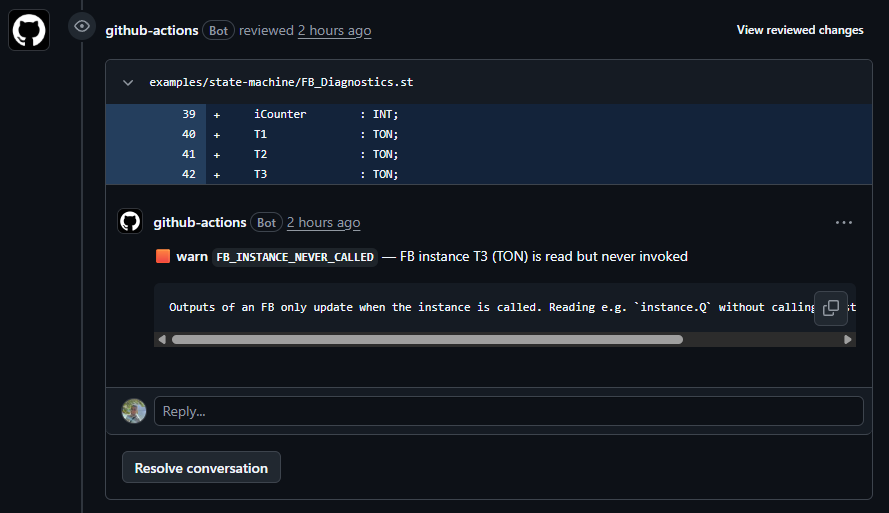

# plc-st-review

**Catch the PLC bugs your IDE can't.** Semantic linter, code reviewer, and team-style enforcer for IEC 61131-3 Structured Text. Built for CI on PLC codebases that can't be compiled outside the vendor IDE, so your pipeline catches what the compiler never even sees.

[Try it in 60 seconds](#try-it-in-60-seconds){ .md-button .md-button--primary } [View on GitHub](https://github.com/HeytalePazguato/plc-st-review){ .md-button } [Install from npm](https://www.npmjs.com/package/plc-st-review){ .md-button }

{ width="720" }

## What it catches

A small slice of what the bot would flag on a PR you might ship today:

```
🟥 error  TIMER_VALUE_CHANGED
Timer T_StartupDelay.PT: T#2s → T#200ms (10.0× faster)

🟧 warn   CONSTANT_VALUE_CHANGED
Constant SAFETY_TIMEOUT: T#2s → T#10s
Identifier prefix matches a safety-critical pattern.

🟥 error  ARRAY_INDEX_OUT_OF_BOUNDS
arr[15] is out of declared bounds [0..9]

🟥 error  INFINITE_LOOP
WHILE TRUE loop with no EXIT statement

🟧 warn   FB_INSTANCE_NEVER_CALLED
FB instance T3 (TON) is read but never invoked
Outputs of an FB only update when the instance is called.
```

The [live demo PR](https://github.com/HeytalePazguato/plc-st-review/pull/1) shows **all 56 categories** firing on a single PR, with the exact inline comments the bot posts. No mock-ups, no edited screenshots.

## Why this matters

Industrial PLC code rarely runs through the kind of pre-merge review that modern software shops take for granted:

- **No headless compiler.** TwinCAT, CODESYS, GX Works, the build only happens inside the vendor IDE, on the developer's workstation. CI pipelines can't repeat it.
- **Code review by visual scan.** Even good shops review `.st` diffs by reading them, and the human eye misses ten-times-faster timers, silently-removed enum values, and renamed-but-not-updated POU callers.
- **High blast radius.** A wrong `TON.PT` doesn't crash a test suite; it crashes the conveyor at 03:00.

`plc-st-review` reads `.st` files with a real [tree-sitter](https://github.com/HeytalePazguato/tree-sitter-iec61131-3-st) grammar, the same kind GitHub itself uses for syntax highlighting, and flags the changes that matter, deterministically. **No LLM involved.** Findings are reproducible, the same input always produces the same output, and you can read every check's source code in [`src/engine/checks/`](https://github.com/HeytalePazguato/plc-st-review/tree/main/src/engine/checks).

## Three ways to use it

- **Static linter on every push**: `plc-st-review --lint "src/**/*.st"`. 35 single-revision checks for ST bugs (division by zero, infinite loops, timer / counter misuse, output-var reads, unused vars, naming conventions, forbidden symbols, more). No PR workflow required.
- **PR / MR reviewer**: posts inline review comments anchored to the lines that triggered findings. Adds 17 diff-based checks (signature drift, outdated call sites, enum removals, `EXTENDS` swaps, pragma changes, timer / counter value bumps, etc.). Ships as a [GitHub Action](github-setup.md) and a [GitLab CI job](gitlab-setup.md).
- **Team-style enforcer**: drop a `.plc-st-review.yml` listing your `naming_conventions` (prefix / suffix / pattern per declaration kind) and `forbidden_symbols`; both modes pick it up automatically.

## The 56 check categories

| Category | What fires it |
|---|---|
| **Diff-based (21)**: compare before and after | |
| `SIGNATURE_CHANGED` | POU input / output signature changed |
| `CALL_SITE_OUTDATED` | call doesn't pass required args, or passes unknown ones |
| `TYPE_MISMATCH` | global's declared type changed |
| `ENUM_VALUE_REMOVED` | enum value gone, but still referenced |
| `ENUM_VALUE_ADDED` | enum gained a value, CASE has no branch and no ELSE |
| `TIMER_VALUE_CHANGED` | `TON` / `TOF` / `TP` `PT` changed; severity scales by ratio |
| `CONSTANT_VALUE_CHANGED` | `VAR_GLOBAL CONSTANT` value changed |
| `COMMENT_ONLY` | AST identical, only comments differ |
| `ARRAY_BOUNDS_CHANGED` | array `[lower..upper]` bounds changed |
| `LOOP_BOUNDS_CHANGED` | `FOR` iteration count changed |
| `POU_DELETED` | POU removed; callers still reference it |
| `POU_RENAMED` | POU renamed (same signature) |
| `METHOD_ADDED_TO_INTERFACE` | new interface method; implementers missing it |
| `INHERITANCE_CHANGED` | `EXTENDS` clause changed |
| `PRAGMA_CHANGED` | pragma added / removed / changed |
| `COUNTER_VALUE_CHANGED` | `CTU` / `CTD` / `CTUD` `PV` changed |
| `UNUSED_VAR_INTRODUCED` | new variable declared but never used |
| `COMPLEXITY_INCREASED` | POU cyclomatic complexity rose past the threshold |
| `NESTING_INCREASED` | POU nesting depth rose past the threshold |
| `LOC_SPIKE` | POU lines of code grew by more than 50% in one PR |
| `DEAD_POU_INTRODUCED` | new POU nothing in the project calls (needs `--project-scope`) |
| **Static integrity (6)**: single-revision, AST-level | |
| `ENUM_VALUE_UNUSED` | enum value declared but never referenced |
| `ENUM_MEMBER_UNKNOWN` | `E_State.IDEL`-style typo against a known enum |
| `ARRAY_INDEX_OUT_OF_BOUNDS` | literal index outside declared bounds |
| `DIVISION_BY_ZERO` | literal `/ 0` or constant resolving to 0 |
| `INFINITE_LOOP` | `WHILE TRUE` with no `EXIT` |
| `LOOP_BOUNDS_REVERSED` | `FOR` step direction disagrees with start / end |
| **FB-instance integrity (7)**: standard IEC 61131-3 FB patterns | |
| `COUNTER_PV_ZERO` | counter preset of 0 |
| `TIMER_PT_ZERO` | `TON(PT := T#0s)` fires immediately |
| `TIMER_NOT_DRIVEN` | `T1.Q` read but no call sets `IN` |
| `EDGE_TRIG_REUSED` | one `R_TRIG` fed by multiple `CLK` |
| `FB_INSTANCE_DOUBLE_CALL` | same instance called twice in one scope |
| `FB_INSTANCE_NEVER_CALLED` | instance read but never invoked |
| `BISTABLE_DOMINANCE_MISMATCH` | `SR` / `RS` choice mismatches the name's intent |
| **Code quality / style (20)** | |
| `EMPTY_STATEMENT` | lone `;` |
| `UNUSED_RETURN_VALUE` | function called as a bare statement |
| `ARRAY_SINGLE_ELEMENT` | `ARRAY [5..5]` |
| `VARIABLE_SHADOWING` | local hides a global |
| `UNQUALIFIED_ENUM_CONSTANT` | bare enum value without type prefix |
| `IDENTIFIER_CASE_MISMATCH` | `ICOUNTER` vs `iCounter` |
| `UNUSED_INPUT_VAR` | `VAR_INPUT` never read |
| `INPUT_VAR_WRITTEN` | assignment to a `VAR_INPUT` |
| `BOOL_COMPARISON` | `IF xButton = TRUE` |
| `REAL_EQUALITY` | `IF rValue = 0.5` |
| `MULTIPLE_EXIT_POINTS` | two or more `RETURN` in a POU |
| `ASSIGNMENT_IN_CONDITION` | `IF x := y THEN` |
| `COMMENTED_OUT_CODE` | commented-out assignment / call |
| `RECURSIVE_CALL` | FB invokes its own type |
| `FORBIDDEN_SYMBOL` | reference to a blocklisted identifier (config) |
| `ADDRESS_OF_CONSTANT` | `ADR()` of a `VAR_GLOBAL CONSTANT` |
| `UNUSED_OUTPUT_VAR` | `VAR_OUTPUT` declared but never written |
| `OUTPUT_VAR_READ_INTERNALLY` | `VAR_OUTPUT` read inside the same POU |
| `NESTED_COMMENTS` | `(* outer (* nested *) *)` |
| `NAMING_CONVENTION` | team-configured prefix / suffix / pattern violation |

The [Checks reference](checks-reference.md) has a dedicated page per category, with an ST code example and a suggested fix.

## Try it in 60 seconds

### GitHub

Drop this into `.github/workflows/plc-st-review.yml`:

```yaml
name: PLC ST review
on:
  pull_request:
    paths: ['**/*.st', '**/*.ST']
permissions:
  contents: read
  pull-requests: write
jobs:
  review:
    runs-on: ubuntu-latest
    steps:
      - uses: actions/checkout@v4
        with:
          fetch-depth: 0
      - uses: HeytalePazguato/plc-st-review@v0
```

Open any PR that touches a `.st` file. The bot posts inline review comments within ~30 s.

### GitLab

Drop this into `.gitlab-ci.yml`:

```yaml
plc-st-review:
  image: ghcr.io/heytalepazguato/plc-st-review:v0
  rules:
    - if: $CI_PIPELINE_SOURCE == "merge_request_event"
  variables:
    GITLAB_TOKEN: $CI_JOB_TOKEN
    GITLAB_URL: $CI_SERVER_URL
    GITLAB_PROJECT_ID: $CI_PROJECT_ID
  script:
    - plc-st-review --gitlab --mr "$CI_MERGE_REQUEST_IID"
```

Works on `gitlab.com` and self-hosted instances. The image is **public** on GHCR, no `docker login` required.

### Static linter (no PR workflow required)

```yaml
lint-st:
  image: ghcr.io/heytalepazguato/plc-st-review:v0
  script:
    - plc-st-review --lint "src/**/*.st"
```

Runs on every push, fails the pipeline on findings at or above the `reporting.fail_on_severity` threshold. The 17 diff-based categories auto-disable; the other 35 fire as a static linter.

### Local

```sh
npm install -g plc-st-review
plc-st-review --lint "src/**/*.st"           # static lint
plc-st-review --base main --head HEAD        # diff current branch
plc-st-review --files old.st new.st          # compare two files
```

## What's next

- [Checks reference](checks-reference.md), every category, with ST examples
- [Tuning severities](tuning-severities.md), per-category overrides, fail thresholds
- [Preset packs](preset-packs.md), share naming / severity bundles via `extends:`
- [Writing custom checks](writing-custom-checks.md), the engine internals
- [Lint mode](lint-mode.md), the static-only CI path
- [GitHub setup](github-setup.md) · [GitLab setup](gitlab-setup.md)

## Links

- [Issues](https://github.com/HeytalePazguato/plc-st-review/issues)
- [Discussions](https://github.com/HeytalePazguato/plc-st-review/discussions)
- [Releases](https://github.com/HeytalePazguato/plc-st-review/releases)
- [Security policy](https://github.com/HeytalePazguato/plc-st-review/blob/main/SECURITY.md)
- [npm](https://www.npmjs.com/package/plc-st-review) · [GHCR image](https://github.com/HeytalePazguato/plc-st-review/pkgs/container/plc-st-review)
