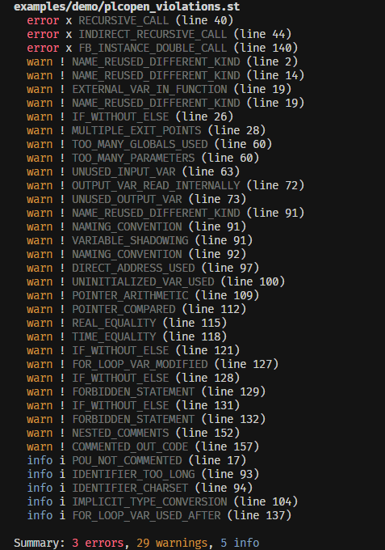

# PLCopen Coding Guidelines preset

[**PLCopen Coding Guidelines v1.0**](https://plcopen.org/guidelines/guidelines) is the closest thing the IEC 61131-3 world has to MISRA-C — ~60 rules spanning naming, comments, language constructs, coding practice, and vendor-specific extensions. `plc-st-review` ships a preset that **enforces every PLCopen rule it implements** and lays out — in the mapping table below — exactly which rules ship as real, runnable checks and which are out of scope for this tool.

The preset targets the **standard, vendor-neutral** PLCopen guidelines — no dialect quirks, no vendor idioms — so it works regardless of whether your code is built in CODESYS, TwinCAT, or any other IEC 61131-3 environment.

## How to use it

Add to your `.plc-st-review.yml`:

```yaml
extends:
  - ./presets/plcopen.yml

# Override anything the preset sets if your team disagrees with PLCopen on
# specific rules — `extends` is a baseline, not a straitjacket.
naming_conventions:
  bool: { prefix: b }    # we use `b` instead of PLCopen's `x` for BOOL

# Or relax a numeric cap.
limits:
  max_parameters: 12
```

[How `extends` works.](../preset-packs.md)

## See it in action

A single deliberately-bad function block can trip nearly the entire PLCopen set at once. With the preset enabled, `plc-st-review --lint <file> --compact` prints one line per finding:

{ width="720" }

`--compact` collapses each finding to a single line (severity + category + line); drop it for the full per-finding explanation. This surfaces all **29 single-revision PLCopen checks** in one run. Four more — `DEAD_POU_INTRODUCED` (CP2), `COMPLEXITY_INCREASED` / `NESTING_INCREASED` (CP9), `UNUSED_VAR_INTRODUCED` (CP24), and `MULTI_WRITER_GLOBAL` (CP26) — are diff- or project-scoped, so they appear in a PR review or with `--project-scope`, not in a single-file `--lint`.

## What the preset turns on

The preset:

- Enables **every PLCopen-aligned check that ships in the engine** at the severity PLCopen recommends.
- Sets `metrics.thresholds` (cyclomatic complexity 10/20, nesting 4/6) per **CP9**.
- Sets `limits` for **N6** (identifier length 32), **CP18** (10 globals per POU), **CP23** (8 parameters per POU).
- Sets `naming_conventions` for every dimension (bool → `x`, int → `i`, real → `r`, …; FB-types → `FB_` prefix; constants → `^[A-Z][A-Z0-9_]+$`).

## Mapping table

Legend:

- **mapped** — the rule is enforced by a check the preset enables.
- **out of scope** — the rule's intent is outside what this tool can decide statically (typically: task scheduling, cycle-time semantics, subjective intent rules). These need a different tool or a human reviewer; the preset does not pretend to cover them.

### Naming (N)

| Rule | Title | Status | Check |
|---|---|---|---|
| **N1** | Avoid physical addresses (`%I0.0`, `%Q1.2`) | **mapped** | `DIRECT_ADDRESS_USED` |
| **N2** | Define type prefixes for variables | **mapped** | `NAMING_CONVENTION` (per-dimension prefixes set) |
| **N4** | Constants in `UPPER_CASE` | **mapped** | `NAMING_CONVENTION` (`constant.pattern = ^[A-Z][A-Z0-9_]+$`) |
| **N5** | Local names shall not shadow global names | **mapped** | `VARIABLE_SHADOWING` (→ warn) |
| **N6** | Define an acceptable name length | **mapped** | `IDENTIFIER_TOO_LONG` (cap via `limits.max_identifier_length`, default 32) |
| **N8** | Define an acceptable character set | **mapped** | `IDENTIFIER_CHARSET` (regex via `identifier_charset`; preset sets the IEC 61131-3 default) |
| **N9** | Different element kinds shall not share a name | **mapped** | `NAME_REUSED_DIFFERENT_KIND` |
| **N10** | Naming rules for user-defined types | **mapped** | `NAMING_CONVENTION` (`enum_type`, `structure_type`, …) |

### Comment (C)

| Rule | Title | Status | Check |
|---|---|---|---|
| **C1** | Comments shall describe intent | out of scope | Intent isn't statically checkable. |
| **C2** | All elements shall be commented | **mapped** | `POU_NOT_COMMENTED` |
| **C3** | Avoid nested comments | **mapped** | `NESTED_COMMENTS` (→ warn) |
| **C4** | Comments may not include code | **mapped** | `COMMENTED_OUT_CODE` (→ warn) |
| **C5** | Use single-line comments | out of scope | Style preference; a formatter does this better. |

### Language (L) — Structured Text

| Rule | Title | Status | Check |
|---|---|---|---|
| **L10** | Forbid `CONTINUE`, `EXIT`, `GOTO` | **mapped** | `FORBIDDEN_STATEMENT` |
| **L12** | Loop counter shall not be modified inside the loop | **mapped** | `FOR_LOOP_VAR_MODIFIED` |
| **L13** | Loop counter shall not be used after the loop | **mapped** | `FOR_LOOP_VAR_USED_AFTER` (info) |
| **L17** | Each `IF` shall have an `ELSE` clause | **mapped** | `IF_WITHOUT_ELSE` |

### Coding practice (CP)

| Rule | Title | Status | Check |
|---|---|---|---|
| **CP1** | Access to a member shall be by name | **mapped** | `DIRECT_ADDRESS_USED` (same shape as N1) |
| **CP2** | All code shall be used in the application | **mapped** | `DEAD_POU_INTRODUCED` (needs `--project-scope` to see callers outside the diff) |
| **CP3** | All variables shall be initialised before being used | **mapped** | `UNINITIALIZED_VAR_USED` (source-position heuristic; doesn't model control flow) |
| **CP6** | Avoid `VAR_EXTERNAL` inside function-like POUs | **mapped** | `EXTERNAL_VAR_IN_FUNCTION` |
| **CP8** | Floating-point compare shall not be `=` / `<>` | **mapped** | `REAL_EQUALITY` (→ warn) |
| **CP9** | Limit POU code complexity | **mapped** | `metrics.thresholds` (cyclomatic 10/20, nesting 4/6) |
| **CP10** | Avoid multiple writes from multiple tasks | out of scope | No task-model awareness in the engine (CP26 covers the related PROGRAM-level case). |
| **CP12** | Physical outputs shall be written once per cycle | out of scope | No cycle-time semantics. |
| **CP13** | POUs shall not call themselves (direct + indirect) | **mapped** | `RECURSIVE_CALL` (direct) + `INDIRECT_RECURSIVE_CALL` (cycles in the call graph), both → error |
| **CP14** | POUs shall have a single point of exit | **mapped** | `MULTIPLE_EXIT_POINTS` (→ warn) |
| **CP16** | Tasks shall only call program POUs | out of scope | No task-model awareness. |
| **CP17** | Parameter usage shall match declaration mode | **mapped (partial)** | `CALL_SITE_OUTDATED` catches missing-required and unknown-arg-name cases. Mode-vs-usage finer-grained matching is out of scope for v0.x. |
| **CP18** | Limit use of global variables | **mapped** | `TOO_MANY_GLOBALS_USED` (cap via `limits.max_globals_used_per_pou`, default 10) |
| **CP20** | FB instances should be called only once per cycle | **mapped** | `FB_INSTANCE_DOUBLE_CALL` (→ error) |
| **CP21** | Use `VAR_TEMP` for temporaries | out of scope | Detecting "which locals could be VAR_TEMP" needs intent / lifetime analysis. |
| **CP22** | Select appropriate data type | out of scope | Subjective; depends on application semantics. |
| **CP23** | Max number of input/output/in-out variables | **mapped** | `TOO_MANY_PARAMETERS` (cap via `limits.max_parameters`, default 8) |
| **CP24** | Do not declare variables that are not used | **mapped** | `UNUSED_VAR_INTRODUCED`, `UNUSED_INPUT_VAR`, `UNUSED_OUTPUT_VAR` (all → warn) |
| **CP25** | Data type conversions shall be explicit | **mapped** | `IMPLICIT_TYPE_CONVERSION` (catches INT-family vs REAL-family mix in arithmetic; full type inference is still out of scope) |
| **CP26** | A global variable may be written by only one PROGRAM | **mapped** | `MULTI_WRITER_GLOBAL` (project-scoped — needs `--project-scope`) |
| **CP28** | TIME equality / inequality shall not be used | **mapped** | `TIME_EQUALITY` |

### Vendor extensions (E)

| Rule | Title | Status | Check |
|---|---|---|---|
| **E2** | Pointer arithmetic shall not be used | **mapped** | `POINTER_ARITHMETIC` (tracks POINTER-typed locals across binary `+ - * /`) |
| **E3** | Some comparator instructions shall not be used for pointers | **mapped** | `POINTER_COMPARED` (relational `< > <= >=` on POINTER-typed locals) |

## Summary

| Bucket | Count |
|---|---|
| **mapped** (enforced by the preset) | 30 |
| **mapped (partial)** | 1 (CP17) |
| **out of scope** (intent / task model / cycle-time semantics) | 5 |

Every rule in the **mapped** bucket runs out of the box when you `extends:` this preset; no extra wiring required. The remaining **out of scope** rules are inherently semantic (CP21 lifetime intent, CP22 type selection) or need a runtime model the engine doesn't have (CP10 task-level concurrency, CP12 cycle-time semantics, CP16 task→POU calls) — they need a different tool or a human reviewer.

The preset closes every PLCopen rule that `iec-checker` ships, plus the engine's full diff-aware / inline-PR-review / FB-instance / metrics surface on top.

## Configurability

The numeric caps and identifier-charset regex are tunable in your own config (or via another preset layered on top):

```yaml
limits:
  max_identifier_length: 64       # PLCopen N6 — bump this if you have long descriptive names
  max_globals_used_per_pou: 20    # PLCopen CP18
  max_parameters: 12              # PLCopen CP23

# PLCopen N8 — broaden the regex if your team allows extra characters.
identifier_charset: '^[A-Za-z_][A-Za-z0-9_]*$'
```

Set any limit to `0` (or omit the key) to disable that individual check.

## What the preset deliberately does NOT do

- **It does not pick a dialect.** PLCopen guidelines are vendor-neutral; the preset is too. If you want vendor- or team-specific rules on top, layer them via a second `extends:` entry — see [Preset packs](../preset-packs.md#a-worked-example).
- **It does not override `case_sensitive`.** PLCopen doesn't speak to dialect case sensitivity. Set [`case_sensitive`](../case-sensitivity.md) to match your toolchain separately.
- **It does not pretend to enforce every PLCopen rule.** The 8 "out of scope" rows are honest: they need a runtime model, type inference, or human judgement this tool doesn't have.
